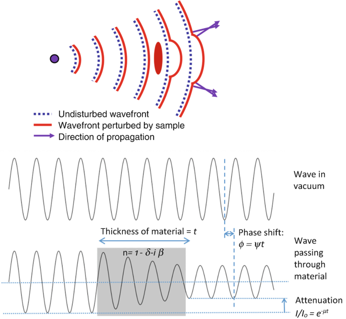
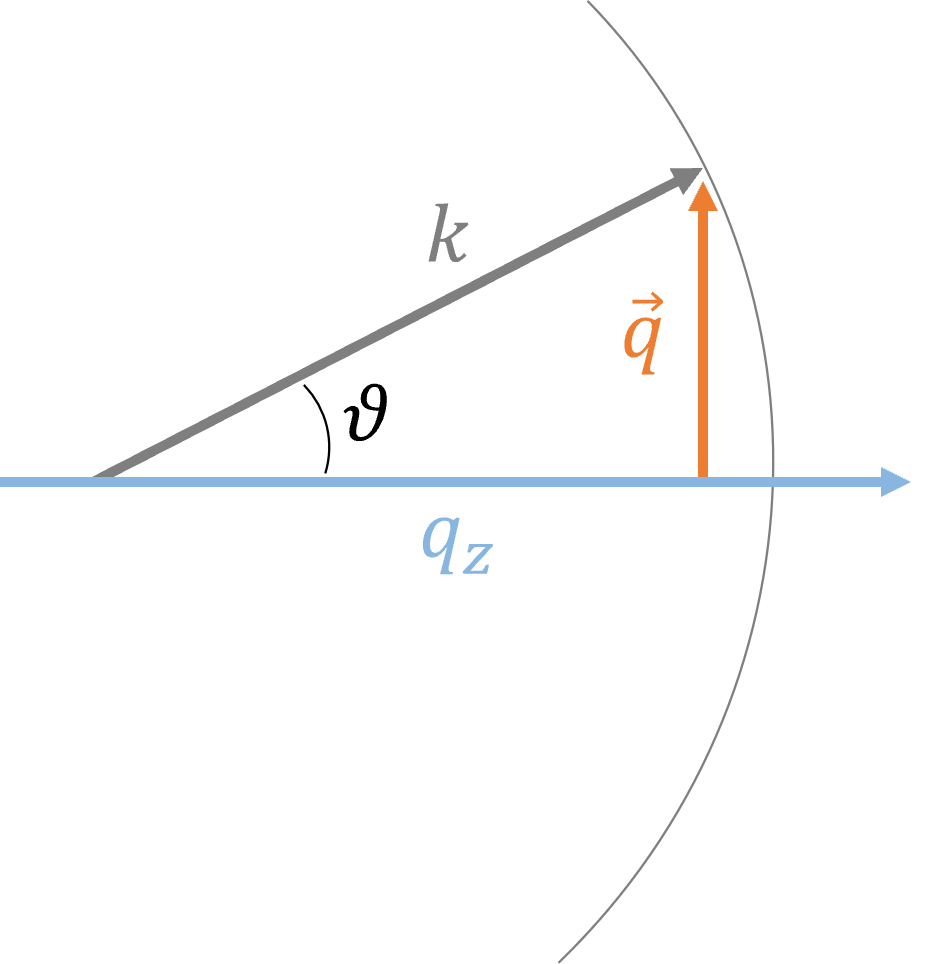

# X-ray phase contrast

When X-rays propagate through matter, they exhibit changes in both amplitude and phase. Conventional absorption-based X-ray imaging measures the change in amplitude, which reflects how much the beam is absorbed inside matter. On the other hand, X-ray phase contrast imaging detects the phase shifts that occur in X-rays as they traverse matter.  In the diagnostic X-ray energy range, this phase shift is generally more relevant than the intensity change. This distinction is particularly important when imaging soft biological tissues, which often lack contrast in conventional absorption-based imaging, thus often requiring the use of contrast agents. For this reason, phase contrast imaging provides significantly enhanced contrast, especially in regions where conventional absorption imaging fails to distinguish between materials with similar attenuation coefficients.

Thanks to the availability of high-brilliance synchrotron sources and, more recently, advanced X-ray laboratory sources, it has become routine to observe and exploit refraction and interference phenomena in X-ray fields.

Various techniques exist to convert the phase shifts of X-rays into modulations of intensity recorded at the detector. Among them, Free-space propagation is probably the simplest, requiring only an appropriate propagation distance between the sample and the detector to make phase effects detectable [Snigirev et al. 1995, Wilkins et al. 1996]. Another method is synchrotron-based Analyzer-based imaging. This approach employs two crystals: the first serves as monochromator and collimator, while the second acts as an angular filter that translates phase-induced deviations into intensity modulations [Chapman et al. 1997]. Grating-based methods use periodic structures to encode and analyse the X-ray wavefront.Initially developed at synchrotron facilites using two gratings [Clauser and Reinsch 1992], this method has been extended to low-brilliance sources by adding a third grating [Pfeiffer et al. 2006]. Another category of X-ray phase-contrast imaging techniques is based on the use of structured illumination to extract information about absorption, refraction and scattering. A known pattern, such as an absorption grid [Vittoria et al. 2015b] or a speckle pattern [Morgan et al. 2012] is imposed on the beam. Phase shifts introduced by the sample distort the pattern, while absorption reduces the overall intensity of the pattern. By tracking these modifications, it is possible to recover absorption and refraction images. These approaches can have two-dimensional sensitivity [Wen et al. 2010] and can be sensitive to scattering or dark-field signals [Berujon et al. 2012]. Another effective approach is Edge illumination [Olivo and Speller 2007], which relies on masking the beam with coded apertures detect phase shifts through beam deflections. This technique is particularly well-suited for use with incoherent and polychromatic X-ray sources.


<figure>
  
  <figcaptio n>Figure 1An X-ray wave that interact with matter is subject to both amplitude attenuation
and phase shift. Figure taken from [Mayo and Endrizzi 2019]on</figcaption>
</figure>

## X-rays as waves

Many experimental phase contrast techniques are based on the wave nature of X-rays. To model this, we start from the Helmholtz equation, which is the time-independent form of the wave equation, and can be written, in scalar approximation, as:

$$
  \nabla^2 \psi + n^2 k^2 \psi = 0
  \tag{1}
$$

where $n$ is the index of refraction, $k = 2\pi/\lambda$ is the wave number, and $\lambda$ is the wavelength.

We define the Green's function $G$, which we will need to write the solution to the Helmholtz equation:

$$
  (\nabla^2 + n^2 k^2) \ G = \delta
$$

where $\delta$ is the Dirac delta function. This allows to express the solution in terms of a self-consistent integral, which represents the solution for a point source emitter:

$$
  \psi = G * (n^2 \psi)
$$

This can be solved in many different ways. We will start by considering the simplest case, i.e. wave propagation in free space (n=1).


### X-ray propagation in free space

First we consider the case $n=1$ (free space propagation). In this case, the general solution is going to be:

$$
  \psi (\vec r) = \sum_{\vec Q} A_{\vec Q} e^{i \ \vec Q \cdot \vec r}
  \tag{2}
$$ 

where $ \lvert \vec Q \rvert = k$. If the wave is propagating along the $z$ axis, $\vec Q$ can be written as $\vec Q = ( \vec q, q_z)$. By inserting the general solution in the free-space Helmoltz equation we get:

$$
   \lvert \vec Q \rvert ^2 = k^2 = \vec q ^2 + q_z^2 \ \Rightarrow \ q_z = \pm \sqrt{k^2 - q^2}
$$

and

$$
    \vec Q \cdot \vec r = \vec q \cdot \vec r_\bot + \vec q_z z = \vec q \cdot \vec r_\bot \pm \sqrt{k^2 - q^2} z
$$

We can now rewrite equation (2):

$$
  \psi (\vec r_\bot, z) = \sum_{\vec q} A_{\vec q}^+ e^{i \ ( \vec q \cdot \vec r_\bot + z \sqrt{k^2 - q^2})} + A_{\vec q}^- e^{i \ (\vec q \cdot \vec r_\bot - z \sqrt{k^2 - q^2})}
$$ 

This equation represents the sum of two waves, one propagating in the positive direction, and one in the negative direction. We are only interested in forward propagation, so the second term cancels out and the equation becomes the following:

$$
  \psi (\vec r_\bot, z) = \sum_{\vec q} A_{\vec q}^+ e^{i \ ( \vec q \cdot \vec r_\bot + z \sqrt{k^2 - q^2})}
$$ 

The boundary condition corresponds to $\psi (\vec r_\bot, z=0)$ and it is known:

$$
  \psi (\vec r_\bot, z=0) = \sum_{\vec q} A_{\vec q}^+ e^{i \ \vec q \cdot \vec r_\bot}
$$ 

The coefficients $A_{\vec q}^+$ can therefore be calculated as the Fourier transform of the wave at $z=0$:

$$
    A_{\vec q}^+ = \mathcal{F}_{2D} \{ \psi(\vec r_\bot, z=0)\}
$$

Finally, the solution to the wave equation in free space can be written as:

$$
  \psi (\vec r_\bot, z) = \mathcal{F}^{-1} \{ \mathcal{F} \{ \psi(\vec r_\bot, z=0) \} e^{iz \sqrt{k^2 - q^2}}\}
$$ 

By writing the following:

$$
 \sqrt{k^2 - q^2} = k \  \sqrt{1 - \frac{q^2}{k^2}}
$$


<figure>
  
  <figcaption> Figure 2: Angular spectrum formulation. </figcaption>
</figure>

and looking at the picture it is easy to understand that $ \frac{\lvert \vec q \rvert }{ k} = sin \theta$. This is the so-called Angular Spectrum Formulation of a propagated wavefield.

###  X-ray propagation through matter

When $ n != 1 $, the solution to the problem is rather complicated. We will consider the most straightforward approximation regime. For mostly propagating waves we can then write:

$$
  \psi = \Psi e^{ikz}\
  \tag{3}
$$ 

From the previous equation, it is straightforward to calculate the following:

$$
    \nabla^2 \psi = \nabla^2 (\Psi e^{ikz}) + 2ik \partial_z \Psi e^{ikz} - k^2 \Psi e^{ikz}
$$

We now use this to insert equation (3) in the Helmoltz equation:

$$
    \nabla^2 \Psi + 2ik \partial_z \Psi + k^2 ( n^2 - 1) \Psi = 0
$$

Considering that the index of refraction n is close to unit, we write it as $ n = 1 + \delta n $, and $ n^2 \approx 1 + 2 \delta n$:

$$
    \nabla^2 \Psi + 2ik \partial_z \Psi + 2 k^2 \delta n \Psi = 0
    \tag{4}
$$

Assuming that the index of refraction $n$ varies smoothly, also the wave function is going to vary smoothly, which implies:

$$
    \lvert \nabla^2 \Psi \rvert << k^2
$$

This is called the projection approximation. Under this approximation, equation 4 becomes:

$$
    \partial_z \Psi = - ik \delta n \Psi
$$

Integrating:

$$
    \Psi (\vec r_\perp , z) = \Psi (\vec r_\perp , 0) exp \biggl\{-ik \int_0^z \delta n(\vec r_\perp , z) dz\biggr\}
$$

For X-rays, the index of refraction is $ n = 1 - \delta +i\beta$, where $\delta$ accounts for phase shifts and $\beta$ for absorption. Since $\delta,\beta << 1$, $n$ can be rewritten as $n=1+\delta n$, with $\delta n = i\beta-\delta$. We can then write:

$$
    \Psi (\vec r_\perp , z) = \Psi (\vec r_\perp , 0) exp\biggl\{-ik \int_0^z \delta dz - k\int_0^z \beta dz\biggr\} = \Psi (\vec r_\perp , 0) exp(i \Phi - \frac{1}{2} \mu z)
$$

The phase shift of the wave is defined as $ \Phi = -k \int_0^z \delta dz$. The phase shift is associated with the passage of an X-ray wave through the object and it quantifies the wave-front deformations and associated refractive properties of the object. $\mu = 2\beta k$ is the linear attenuation coefficient, while the intensity of the wave is defined as:

$$
   I(\vec r_\perp , z) = \lvert \Psi(\vec r_\perp , z)\rvert^2 = I_0 exp(-\int_0^z \mu dz)
$$

The measured intensity provides information about the integrated attenuation along an X-ray path, while phase information is typically lost.

## Propagation-based phase-contrast

### The Paganin formula

But how is phase extracted from measurements? In practice, most objects introduce both absorption and phase shifts. As a result, the intensity projection image will contain a mixture of both contributions. The process of separating and quantitatively recovering the phase and amplitude at the exit surface of the sample is known as phase retrieval. Since the aim is to recover both absorption and phase, usually more than a single measurement, either at different propagation distances or at different energies, is required unless some constraints are imposed on the sample [Nugent et al. 1996; Gureyev
et al. 2001]. 
Quantitative phase retrieval with a single measurement can be performed by assuming an homogenous object, which is a reasonable approximation in most cases [Paganin et al. 2002]. In this way, $\delta$ is proportional to $\beta$ throughout the entire sample and:

$$
    \int \delta dz = \delta t \Rightarrow \Phi = -k\delta t\\
    \tag{4} \ and \
    \int \beta dz = \beta t
$$

We consider the transport of intensities equation (TIE), which expresses the conservation of optical energy as the wave-field evolves along the z axis:

$$
    k \frac{\partial I}{\partial z} = - \nabla_\bot \cdot ( I \nabla_\bot \Phi )
    \tag{5}
$$

where $\nabla_\bot$ is the Laplacian operatior in the $xy$ plane, and $\Phi$ is the phase of the wavefield.

If we consider a plane-wave of uniform intensity incident on a sample, then the intensity of the radiation at the exit surface z = 0 ("contact image") of the object can be written as:

$$
    I(\vec r_\bot, z=0) = I^{in}e^{-\mu T(\vec r_\bot)}
    \tag{6}
$$

where $T(\vec r_\bot)$ is the projected thickness of the homogeneous object onto the plane over which the image is taken. 
Similarly, the phase at the exit surface is:

$$
    \Phi(\vec r_\bot, z=0) = k \delta T(\vec r_\bot)
    \tag{7}
$$

For a homogeneous object, we have the relationship $\delta/\beta = \text{constant}$. The phase gradient can be written as:

$$
    \nabla_\bot \Phi = k\delta \nabla_\bot T
$$

Where the dependence from $(\vec r_\bot)$ has been removed for simplicity. From equation (6), we can express the thickness gradient:

$$
    \nabla_\bot T = - \frac{1}{\mu} \nabla_\bot ln (I/I_0) = - \frac{1}{\mu} \frac{\nabla_\bot I}{I} 
$$

Therefore,

$$
    \nabla_\bot \phi = - \frac{k\delta}{\mu} \frac{\nabla_\bot I}{I} 
$$

Substituing into the TIE:

$$
    k \partial_z I = - \nabla_\bot ( I ( - \frac{k\delta}{\mu} \frac{\nabla_\bot I}{I} )) = \frac{k\delta}{\mu}\nabla_\bot^2 I
$$

which gives us:

$$
    \partial_z I = \frac{\delta}{\mu}\nabla_\bot^2 I
    \tag{7}
$$

We consider the finite-distance approximation. We can approximate the derivative with:

$$
    \frac{\partial I}{\partial z} \approx \frac{I(x,y,z+\Delta z) - I(x,y,z)}{\Delta z}
$$

by substituing in equation (7):

$$
    I(x,y,z+\Delta z) \approx I(x,y,z) + \frac{\Delta z \delta}{\mu} \nabla_\bot^2 I(x,y,z)
$$

When we measure the intensity at distance $z = R$ from the object:

$$
    I(x,y,R) \approx I(x,y,0) + \frac{R \delta}{\mu} \nabla_\bot^2 I(x,y,0)
$$

Then:

$$
    (1 + \frac{R \delta}{\mu} \nabla_\bot^2) I(x,y,0) = I(x,y,R)
$$

Taking the Fourier transform and solving:

$$
    \mathcal{F}{I(x,y,0)} = \frac{\mathcal{F}{I(x,y,R)}}{1+ \frac{R \delta}{\mu} \lvert \vec q \rvert^2}
$$

The Paganin formula for phase retrieval is:

$$
    I(x,y,0) = \mathcal{F}^{-1} \biggl\{ \frac{\mathcal{F}{I(x,y,R)}}{1+ \frac{R \delta}{\mu} \lvert \vec q \rvert^2} \biggr\}
$$

This formula allows the reconstruction of the object's attenuation and phase properties from a single propagated intensity measurement, assuming the knowledge of the $\delta / \beta$ ratio.

### In-line holography

Digital inline holography is a phase contrast imaging technique which allows the acquisition of 3D information of small-scale objects through illumination and free-space propagation. This technique requires long propagation distances, with the smallest visible scale being $ < \sqrt(\lambda z)$ where $\lambda$ is the wavelength and $z$ is the propagation distance.

In-line holography has been used for soft X-ray microscopy of biological objects achieving high spatial resolution [Rosenhahn et al. 2009]. To minimize radiation damage to biological samples, single-pulse imaging with intense pulses of some femtoseconds duration are utilized at free-electron lasers. The obtained hologram is reconstructed using the Kirchhoff-Helmholtz transformation:

$$
    K(r) = \int \int I(\xi) exp(ikr \xi)/r^2 d\xi
$$

This expression propagates the recorded wavefront $I(\xi)$ back to different planes to find where the object was located. Here, $\xi$ is the vector that contains the coordinates of the detector, and $K(r)$ is the reconstructed wavefront at the object's location.

In-line holography can also be implemented with hard synchrotron X-rays. While materials weakly absorb hard X-rays, they still affect the phase of the beam. The phase information can be extracted by recording images at multiple distances and applying a reconstruction algorithm.

Following the linearization of the transmittance function approach [Cloetens et al. 1999], for objects where the phase and absorption are small, we can write:

$$
    T(x) = exp[i \phi (x)]
$$

where $\phi (x)$ is the phase shift caused by the sample. For small differences in the phase shift at different propagation distances, the Fourier transform of the intensity distribution can be linearly related to the Fourier transform of $\phi (x)$ provided the nonlinear term $FT[I_{NL,m}(x)]$ is small:

$$
    FT[I_m(x)] = \delta_D(f) + FT[R_m(x)] 2 sin (\pi \lambda D_m f^2)FT[\phi(x)] + FT[I_{NL,m}(x)]
$$

where $FT[R_m(x)] = FT[R(x)] \gamma^c (\lambda D_m f)$ includes the detector transfer function $FT[R(x)]$ and the degree of spatial coherence $\gamma^c (\lambda D_m f)$.

Images at multiple distances are acquired and combined through a least-squares approach in a such a way that the importance of non-linear terms is reduced. Multiple images are necessary to obviate the "blindness" to some spatial frequencies associated with zeros in the sine function. Once phase maps are obtained, images of different angular positions of the samples are combned to produce tomographic reconstruction, enabling 3D characterization of the object.


## Coherence

Coherence is the ability of a wave to produce interference effects. In imaging systems, coherence refers to how well a wavefield can interfere with itself, which is fundamental for phase-contrast imaging techniques. An imaging system has a certain degree of coherence if it is able to produce visible interference patterns. We can define two types of coherence: Longitudinal coherence, which is related to energy spread of the source, and Transverse coherence, which depends on the source size. An ideal imaging system, composed of a monochromatic point-like source, would be perfectly coherent. Real sources will obviously not be ideal, and their  degree of oherence owill depens onhow well  theyapproximate shese  tconditists.

### Longitudinal coherence - polycomaticity
mX-ray sources are typically polychromatic, meaning that they emit a range of wavelengt. D different wavelengths normally have no phase retionshipl ,ithce all measurements made with polychromatic x-rays are simply the sum, in intensity, of a idthe indidual frequencyomponents c, averaging out the interference terms. Howevest This consideration is still compatible with the concept of "longitudinal coherence", which quantifes  the lgen thscales over which a wavefield can interfere with itself along the propagationirection. esThe longitudinal coherence length$ Ll $ quantifies this and is defined as:

$$
    L_l = \frac{\lambda^2}{\Delta \lambda}
$$

where $\lambda$ is the central wavelength, and $\Delta \lambda$ is the spectral bandwidth of the source. The smaller $\Delta \lambda$, i.e. the more monochromatic is the source, the longer the coherence lengis
Typical values for laboratory X-ray sources are in the order of hundreds of nm, while for synchrotron sources values can reach tens of microns.


### Transverse coherence
Transverse coherence defines a scale for the coherence on the object plane (perpendicular to the beam propagation direction). It manily depends on the spatial extent of the source and the propagation distance. Transverse coherence length $ L_t $ is given by:

$$
    L_t = \frac{\lambda z_1}{S}
$$ 
where $z_1$ is the source to sample distance and $S$ is the source size. If an object is smaller than this length, it will "see" the beam as coherent transversel Typical values for a micro-focus laboratory X-ray source are in the order of a micron, while for synchrotron sources values can reach tens of microns.y.For effective phase-contrast imaging, the sample features of interest should be comparable to or smaller than both coherence lengths.


## References

Snigirev, Anatoly, et al. "On the possibilities of x‐ray phase contrast microimaging by coherent high‐energy synchrotron radiation." Review of scientific instruments 66.12 (1995): 5486-5492. 

Wilkins, S. W., et al. "Phase-contrast imaging using polychromatic hard X-rays." Nature 384.6607 (1996): 335-338.

Chapman, Dean, et al. "Diffraction enhanced x-ray imaging." Physics in Medicine & Biology 42.11 (1997): 2015.

Clauser, J. F., and M. W. Reinsch. "New theoretical and experimental results in Fresnel optics with applications to matter-wave and X-ray interferometry." Applied Physics B 54.5 (1992): 380-395.

Pfeiffer, Franz, et al. "Phase retrieval and differential phase-contrast imaging with low-brilliance X-ray sources." Nature physics 2.4 (2006): 258-261.

Vittoria, Fabio A., et al. "X–ray absorption, phase and dark–field tomography through a beam tracking approach." Scientific reports 5.1 (2015): 16318.

Morgan, Kaye S., David M. Paganin, and Karen KW Siu. "X-ray phase imaging with a paper analyzer." Applied Physics Letters 100.12 (2012).

Wen, Harold H., et al. "Single-shot x-ray differential phase-contrast and diffraction imaging using two-dimensional transmission gratings." Optics letters 35.12 (2010): 1932-1934.

Berujon, Sebastien, Hongchang Wang, and Kawal Sawhney. "X-ray multimodal imaging using a random-phase object." Physical Review A—Atomic, Molecular, and Optical Physics 86.6 (2012): 063813.

Olivo, Alessandro, and Robert Speller. "A coded-aperture technique allowing x-ray phase contrast imaging with conventional sources." Applied Physics Letters 91.7 (2007).

Mayo, Sheridan, and Marco Endrizzi. "X-ray phase contrast methods." Handbook of Advanced Non-Destructive Evaluation. Springer, Cham, 2018. 1-42.

Nugent, K. A., et al. "Quantitative phase imaging using hard x rays." Physical review letters 77.14 (1996): 2961.

Gureyev, Timur E., et al. "Quantitative in-line phase-contrast imaging with multienergy x rays." Physical Review Letters 86.25 (2001): 5827.

Paganin, David, et al. "Simultaneous phase and amplitude extraction from a single defocused image of a homogeneous object." Journal of microscopy 206.1 (2002): 33-40.

Rosenhahn, Axel, et al. "Digital in-line holography with femtosecond VUV radiation provided by the free-electron laser FLASH." Optics Express 17.10 (2009): 8220-8228.

Cloetens, Peter, et al. "Holotomography: Quantitative phase tomography with micrometer resolution using hard synchrotron radiation x rays." Applied physics letters 75.19 (1999): 2912-2914.


```python

```
